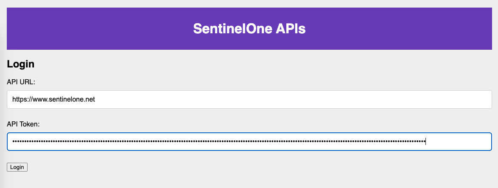

# API Browser Example

This folder contains an example application which has been written for both Node and Python and will query the SentinelOne APIs and return the results in an HTML web application.  The goal is to provide a jump start to using the SentinelOne APIs to create your own lightweight console or data access tool.  Both examples use the same static HTML, CSS and javascript files for the front end. The only difference is the language of the server implementation.

These examples assume you have either Node.js or Python installed on your local machine.

## Python Instructions

1. Download all files in this directory.
2. Install the required libraries:
   
   ```
   pip3 install Flask Flask-Session requests jsonify
   ```

3. Start the server:
   
   ```
   python3 server.py
   ```

4. Open a browser to http://localhost:3000
5. Login and click the buttons to call the APIs.

## Node.js Instructions

1. Download all files in this directory.
2. Initialize the directory:
   
   ```
   npm init -y
   ```

3. Install the required modules:
   
   ```
   npm install express express-session axios body-parser
   ```

4. Start the server: 
   
   ```
   node server.js
   ```

5. Open a browser to http://localhost:3000
6. Login and click the buttons to call the APIs.

## Screenshots

### Login Screen

<br/>
 
### API Calls:


